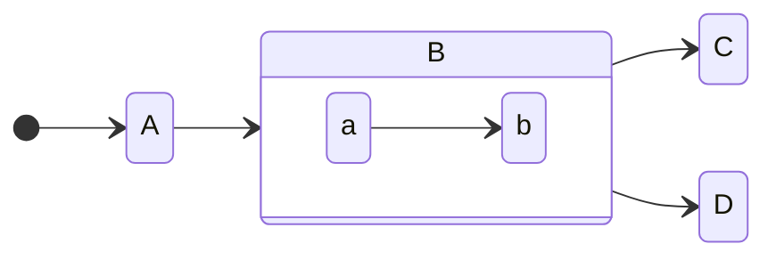

#### Code

```rust
fn foo(bar: &u32) -> Result<(), ()> {
    Ok(())
}
```

```haskell
main = do
    putStr "Yo"
```

#### Mathjax

When $a \ne 0$, there are two solutions to $ax^2 + bx + c = 0$ and they are
$$x = {-b \pm \sqrt{b^2-4ac} \over 2a}.$$

There is a tutorial on mathjax syntax [here](https://math.meta.stackexchange.com/q/5020).

#### Mermaid



