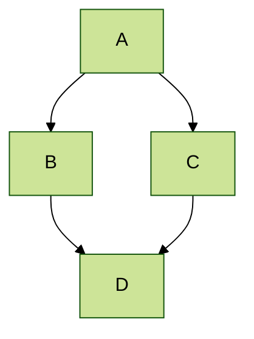

---
page:
  headHtml: |
    <snippet var="js.mermaid" />
    <snippet var="js.syntax" />
---


```mermaid
%%{init: {'theme': 'forest', "flowchart" : { "curve" : "basis" } } }%%
graph TD;
    A-->B;
    A-->C;
    B-->D;
    C-->D;
```

```python
def foo(bar):
    pass
```